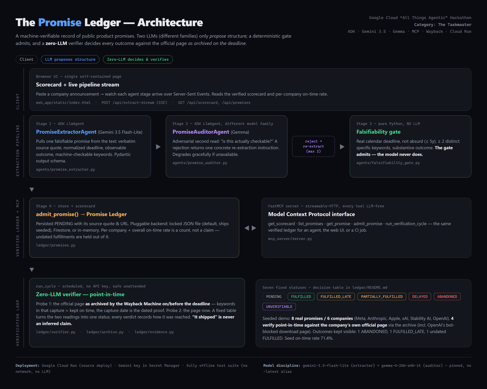

# The Promise Ledger

[](https://github.com/google/adk)
[](https://aistudio.google.com/)
[](https://modelcontextprotocol.io/)
[](https://cloud.google.com/run)
[](LICENSE)

> Built for the **Google Cloud "All Things Agentic" Hackathon**, category **The Taskmaster**.

**A machine-verifiable record of public product promises.** Companies announce
dated commitments constantly ("open weights by end of year", "GA next quarter",
"available later this month"). Nobody keeps an honest, checkable score of which
ones actually shipped, on time. The Promise Ledger does, and — its whole point —
**no LLM decides an outcome**. A promise's status is set by deterministic code
that fetches the official page and checks it.

---

## What it does

1. **Extract** a falsifiable promise from an announcement — an agent (Gemini)
   proposes a structured promise: verbatim source quote, normalized deadline,
   an observable outcome, and machine-checkable keywords.
2. **Audit** it adversarially on a second model family (Gemma) — an independent
   read on "is this actually checkable?". Rejections trigger up to two
   re-extractions.
3. **Gate** it with pure Python — a real deadline, not absurd, ≥2 distinct
   specific keywords, a substantive outcome. The gate admits, not the model.
4. **Verify** it at the deadline with **zero LLM** — fetch the evidence page,
   match keywords as whole tokens, read a ship date if one is on the page, and
   apply a fixed decision table.
5. **Score** it — a per-company and overall scorecard: kept on time / late /
   delayed / abandoned / unverifiable, and an on-time rate that is a count, not
   a claim.

### The seven statuses

`PENDING` · `FULFILLED` · `FULFILLED_LATE` · `PARTIALLY_FULFILLED` · `DELAYED` ·
`ABANDONED` · `UNVERIFIABLE`

The decision table lives in `ledger/README.md` and `ledger/verifier.py`. It is
deliberately fixed and public, so "delayed vs abandoned" is never a judgement
call made after the fact.

---

## Architecture



```
announcement text ──▶ PromiseExtractorAgent  (Gemini, ADK, structured output)   [1]
                        │
                        ▼
                     PromiseAuditorAgent     (Gemma, ADK, adversarial)          [2]
                        │  reject ─▶ re-extract (max 2)
                        ▼
                     falsifiability gate      (pure Python, no LLM)             [3]
                        │
                        ▼
                     admit_promise ──▶ ledger  (JSON file / Firestore)          [4]

ledger  ◀──▶  FastMCP server        get_scorecard · list_promises · get_promise ·
                                    admit_promise · run_verification_cycle
   │
   ▼
run_cycle  (scheduled, zero LLM)   re-fetch every due promise's evidence page,
                                   re-decide its status, persist the change
```

Steps 1–3 stream live in the web app (`/api/extract-stream`). The verification
cycle and every MCP tool are LLM-free.

| Component | Tech |
|---|---|
| `agents/promise_extractor.py` | `google.adk` `LlmAgent`, Gemini, Pydantic `PromiseExtraction` output schema |
| `agents/promise_auditor.py` | `google.adk` `LlmAgent`, Gemma — a genuinely different model family |
| `agents/promise_orchestrator.py` | the extract → audit → re-extract → gate → admit pipeline, as an async event stream |
| `agents/falsifiability_gate.py` | deterministic admission check, no LLM |
| `ledger/evidence.py` | HTTP fetch + HTML→text + whole-token keyword match, no JS |
| `ledger/verifier.py` | the zero-LLM status decision table |
| `ledger/promises.py` | store + scorecard; backend = JSON file / Firestore / in-memory |
| `mcp_server/server.py` | FastMCP server exposing the ledger over the Model Context Protocol |
| `web_app/` | FastAPI + a single static page: scorecard + live pipeline stream |

---

## Quick start

Python 3.11+.

```bash
git clone https://github.com/yobanrg6-coder/the-promise-ledger.git
cd the-promise-ledger
python -m venv venv
source venv/bin/activate            # Windows: venv\Scripts\activate
pip install -r requirements.txt
cp .env.example .env                # add GEMINI_API_KEY for the live extraction demo
```

**Seed the ledger** with the curated demo promises (hand-typed real
announcements; the machine verifies them live — no LLM, no key needed):

```bash
python -m ledger.seed --fresh
```

This writes `data/ledger.json` (a copy is committed, so you can skip this and
still have data).

**Run the app:**

```bash
python run.py           # FastMCP server + web app
# open http://127.0.0.1:8000
```

**Run a verification cycle** (re-checks every due promise against its live
evidence page, zero LLM):

```bash
python -m ledger.run_cycle
```

**Tests:**

```bash
pip install -r requirements-dev.txt
pytest tests/            # no network, no LLM
```

---

## Deploy to Cloud Run

```bash
# Cloud Run builds the container from the Dockerfile - no local Docker needed.
# Store the Gemini key in Secret Manager, never as a plain env var.
echo -n "your_gemini_api_key" | gcloud secrets create gemini-api-key --data-file=-

gcloud run deploy the-promise-ledger --source . --region=us-central1 \
    --allow-unauthenticated --min-instances=1 --max-instances=1 \
    --set-env-vars MODEL=gemini-3.5-flash-lite,LEDGER_BACKEND=json \
    --set-secrets GEMINI_API_KEY=gemini-api-key:latest
```

`data/ledger.json` ships in the image as the baseline scorecard. Cloud Run's
disk is ephemeral, so live writes during a session don't survive a cold start —
set `LEDGER_BACKEND=firestore` for durable writes.

Cloud Run exposes one port (the web app). The FastMCP server also runs in the
container but on an internal port — connect an MCP client to it by running the
stack locally (`python run.py`, then point the client at
`http://127.0.0.1:8080/mcp`). The web app talks to the same ledger module
directly, so the public demo is fully functional without it.

---

## Honest limitations

- **Keyword brittleness.** If a page describes a shipped feature in words that
  don't contain the check keywords, the verifier under-reports it. The seed set
  shows this (`Stability AI` resolves `FULFILLED` but the page has no date, so
  "on-time vs late" can't be established).
- **Evidence decay.** Vendor changelogs are rolling windows; a 2024 entry can
  scroll off by 2026. The verifier is designed to run *near* the deadline.
- **Bot blocks.** Some official pages (`help.openai.com`) return HTTP 403 to
  non-browser clients — that promise resolves `UNVERIFIABLE`, honestly.
- The seed is 8 curated promises across 6 companies — enough to show the
  mechanism, not a census.

---

## Author

Jose (Yoban) Rodríguez · [Google Cloud profile](https://www.skills.google/public_profiles/6bac5b41-ee95-4a9a-b9ee-d871c4e31106) · MIT License
