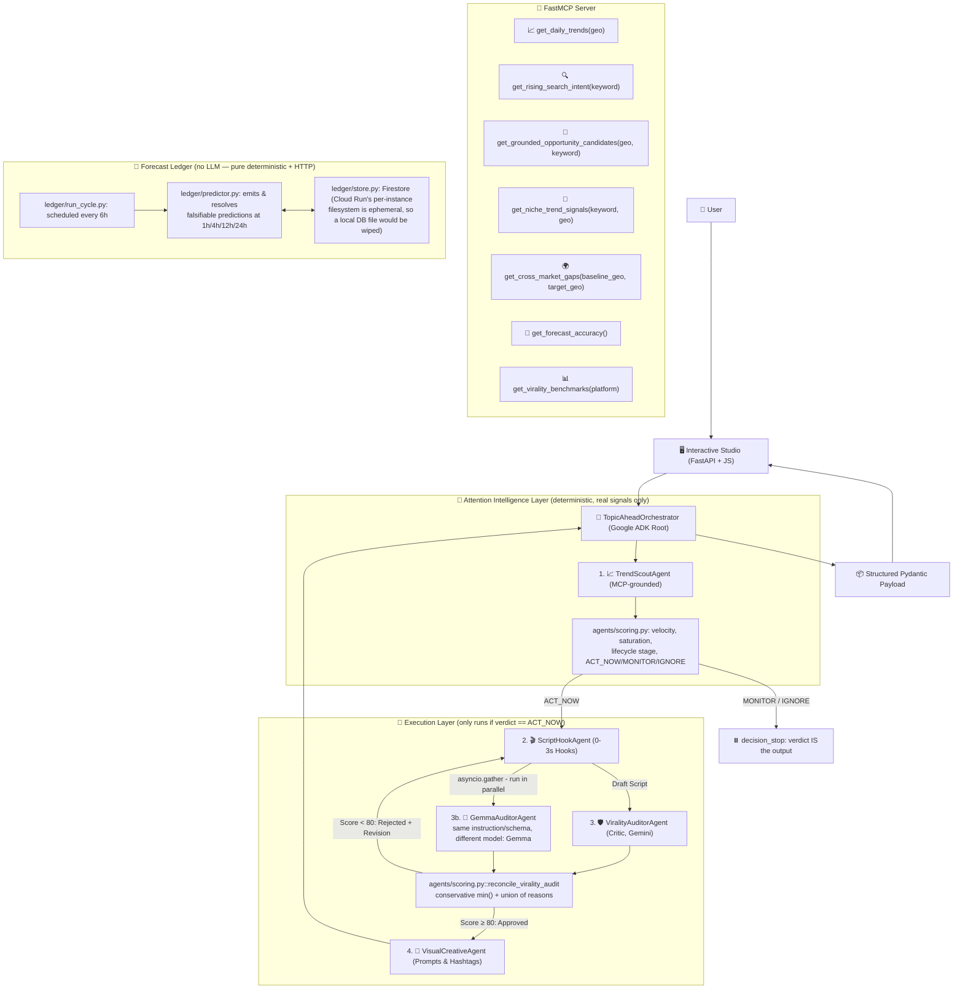
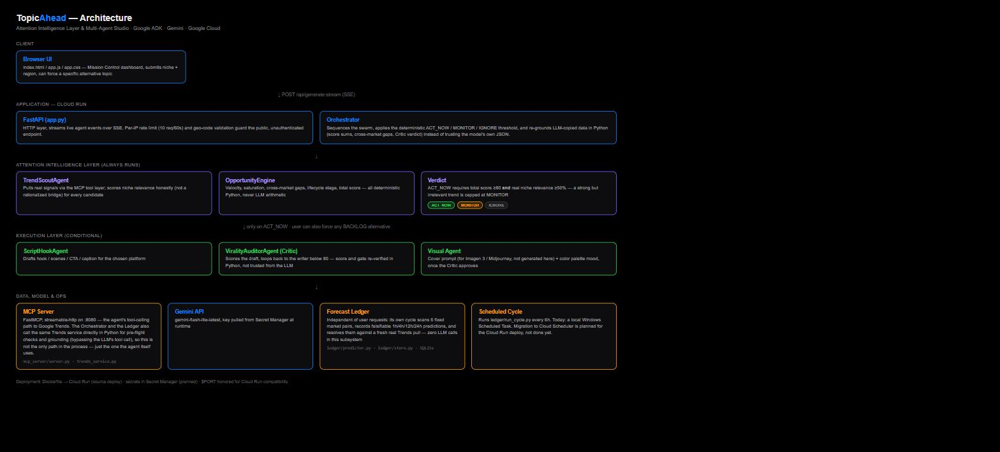

# 🛸 TopicAhead: Autonomous Attention-Timing Intelligence

[](https://github.com/google/adk)
[](https://aistudio.google.com/)
[-blueviolet)](https://modelcontextprotocol.io/)
[](https://cloud.google.com/run)
[](LICENSE)

> Built for the official **Google Cloud "All Things Agentic" Hackathon** ($180,000 USD Prize Pool) under **The Taskmaster** category.

---

## 🌟 Overview & Problem Statement

Trend tools that just say "this is trending right now, here's a caption" are a solved, crowded market — YoTrends, vidIQ, and Virlo already do niche+region trend detection as mature paid products. The real unsolved problem is **timing and accountability**:

1. **No one tells you *when to act*, only *what's hot*.** Detecting a spike is not the same as knowing whether it's worth acting on before it's saturated.
2. **No one verifies their own calls.** Every trend tool markets confidence; none of them publish a falsifiable record of whether their calls were actually right.
3. **Cross-market timing is invisible.** A topic trending in one market today is often not yet visible in another — a real, observable window that generic trend feeds don't surface.

**TopicAhead** is an **Attention Intelligence Layer**: it scores a topic's lifecycle phase and cross-market visibility gap from real signals, renders a deterministic **ACT_NOW / MONITOR / IGNORE** verdict, and — its core differentiator — logs every prediction it makes to a **Forecast Ledger** that resolves itself against real data later, so its accuracy is a checkable number, not a marketing claim. Content generation (script, critic audit, visual direction) is a secondary **Execution Layer** that only runs when the verdict is `ACT_NOW`.

---

## 🏗️ Architecture





---

## 🎯 The Attention Intelligence Layer

Computed deterministically in `agents/scoring.py` from real signals — never guessed by the LLM, so the number on screen can never disagree with its own breakdown:

| Signal | What it measures |
| :--- | :--- |
| **Lifecycle stage** | `EMERGING` → `ACCELERATING` → `BREAKOUT` → `SATURATED`, derived from rank, traffic and news-coverage saturation of a single real snapshot. |
| **Cross-market gaps** | Topics trending in a baseline market (e.g. `US`) not yet visible in a target market (e.g. `MX`) — observed directly, never an invented ETA. |
| **Verdict** | `ACT_NOW` / `MONITOR` / `IGNORE` — a hard threshold on the total score, computed in Python (`derive_recommended_action`), not decided by the LLM. |

## 🔮 The Forecast Ledger

The core differentiator: no competitor researched (VyralFlow, Content_Studio.ai, YoTrends, vidIQ, Virlo) publishes this as a product. Every candidate with real velocity and a real cross-market gap generates falsifiable predictions at **1h, 4h, 12h and 24h** horizons simultaneously, stored with a timestamp in Firestore (see `ledger/README.md` for why this isn't a local SQLite file — Cloud Run's per-instance filesystem is ephemeral). A scheduled Cloud Run Job + Cloud Scheduler cycle (`ledger/run_cycle.py`, every 6 hours) resolves due predictions against a fresh real Trends pull and updates accumulated accuracy stats, exposed live via the `get_forecast_accuracy()` MCP tool. **Zero LLM calls** in this subsystem — pure deterministic computation + HTTP, so it's free, unlimited, and actually falsifiable instead of "the model says it remembers correctly."

---

## 🤖 The Execution Layer (conditional, only on ACT_NOW)

| Agent Name | Role & Responsibility | Core Tools / Engine |
| :--- | :--- | :--- |
| **1. 📈 TrendScoutAgent** | Discovers breakout Google searches, rising search intent, lifecycle stage and cross-market gaps in real time via the FastMCP server (real MCP protocol, `McpToolset`). Also checks a short keyword it distills from the niche against `get_niche_trend_signals` so a narrow niche isn't limited to whatever generic national news is trending that day. | FastMCP Server (`get_grounded_opportunity_candidates`, `get_niche_trend_signals`, `get_cross_market_gaps`) + `agents/scoring.py` |
| **2. 🎬 ScriptHookAgent** | Converts the ACT_NOW opportunity into a high-retention video/carousel script with a 0-3s hook. | Gemini + Pydantic `HookAndScriptResult` |
| **3. 🛡️ ViralityAuditorAgent** | **Critic Loop:** adversarial audit of retention power, brand safety, anti-cliché rules; rejects with a quoted weak line + rewrite until the reconciled virality score ≥ 80 (max 2 drafts). | Gemini + Pydantic `CriticAuditEvaluation` |
| **3b. 🔁 GemmaAuditorAgent** | **Independent second opinion on Gemma** (a genuinely different model family, run concurrently with the Critic via `asyncio.gather`): re-audits the exact same draft with the identical instruction/schema. A weak sub-score or a real rejection reason either model raises is never silently dropped — `agents/scoring.py::reconcile_virality_audit` takes the conservative `min()` of each sub-score and unions the rejection reasons, matching the Critic's own "adversarial by default" philosophy. Degrades to Gemini's read alone if Gemma is unavailable. | Gemma (`gemma-4-26b-a4b-it`) + Pydantic `CriticAuditEvaluation` |
| **4. 🎨 VisualCreativeAgent** | Generates Imagen/Midjourney cover prompts, color palettes, and tiered hashtag clusters for the **approved** script only. | Gemini + Pydantic `VisualDirectivesResult` |

All five run as real `google.adk` `LlmAgent`s executed through an `InMemoryRunner`, not a hand-rolled `google.genai` call disguised as ADK.

---

## 🚀 Quick Start & Local Setup

### Prerequisites
* Python 3.11+ (this project's own venv runs 3.14.3)
* A free Gemini API key from [Google AI Studio](https://aistudio.google.com/)

### 1. Clone & Install Dependencies
```bash
git clone https://github.com/yobanrg6-coder/TopicAhead.git
cd TopicAhead
pip install -r requirements.txt
```

### 2. Configure Environment
```bash
cp .env.example .env
```
Edit `.env` and set your key:
```env
GEMINI_API_KEY=your_actual_gemini_api_key
MODEL=gemini-flash-lite-latest
```
`gemini-flash-lite-latest` is the default because it proved reliable under this project's tool-calling + large structured-output load; `gemini-flash-latest` returned 503 "high demand" repeatedly under the same load in testing.

### 3. Run the Studio (One-Click)
```bash
python run.py
```
Open your browser at **`http://127.0.0.1:8000`**.

### 4. Run the Forecast Ledger cycle manually (optional)
```bash
python ledger/run_cycle.py
```
Needs credentials for the Firestore project (or run it from an environment already authenticated to one — see `ledger/README.md`). In production this runs automatically every 6 hours via a Cloud Run Job triggered by Cloud Scheduler, not a local scheduled task.

### 5. Run the test suite
```bash
pip install -r requirements-dev.txt
pytest tests/
```
46 tests: deterministic scoring (`test_scoring.py`), the ledger against an in-memory fake backend with no network (`test_ledger.py`), and ADK agent construction (`test_agents_construction.py`).

---

## ☁️ Google Cloud Run Deployment

```bash
# Build & deploy directly from source - Cloud Run builds the container itself
# from the Dockerfile, no local Docker or separate gcloud builds step needed.
gcloud run deploy topicahead --source . --region=us-central1

# The Gemini key is never passed as a plain --set-env-vars value (that leaks it
# into shell history and Cloud Run's own config metadata) - store it in Secret
# Manager once, then reference it by name on deploy:
echo -n "your_actual_gemini_api_key" | gcloud secrets create gemini-api-key --data-file=-
gcloud run deploy topicahead --source . --region=us-central1 \
    --min-instances=1 --max-instances=1 \
    --set-env-vars MODEL=gemini-flash-lite-latest \
    --set-secrets GEMINI_API_KEY=gemini-api-key:latest
```

`--min-instances=1` keeps a warm instance running so judges never hit a cold-start abort
(`"no available instance"` 500) on the first request after idle.

---

## 🏆 Author & Hackathon Verification
* **Developer:** Jose (Yoban) Rodríguez
* **Google Cloud Public Profile:** [skills.google/public_profiles/6bac5b41-ee95-4a9a-b9ee-d871c4e31106](https://www.skills.google/public_profiles/6bac5b41-ee95-4a9a-b9ee-d871c4e31106) *(12 Official Skill Badges & GEAR Certified)*
* **License:** MIT
